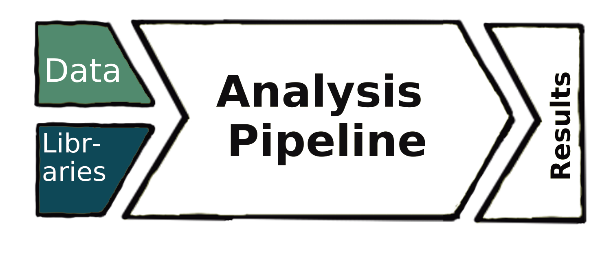
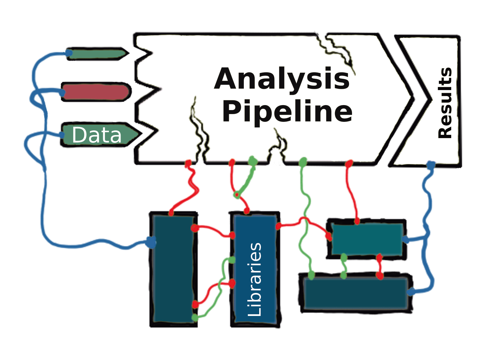
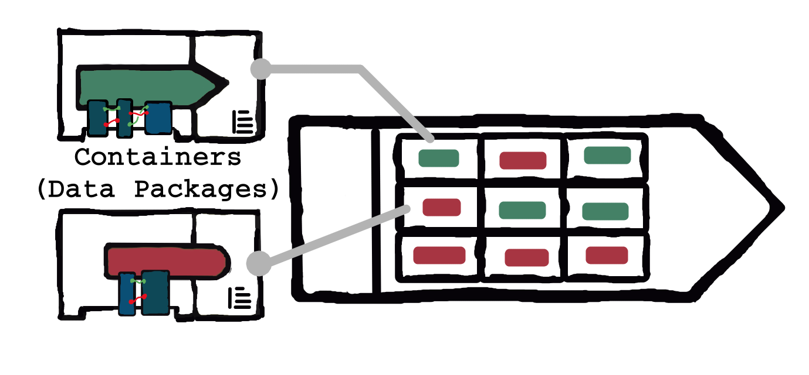
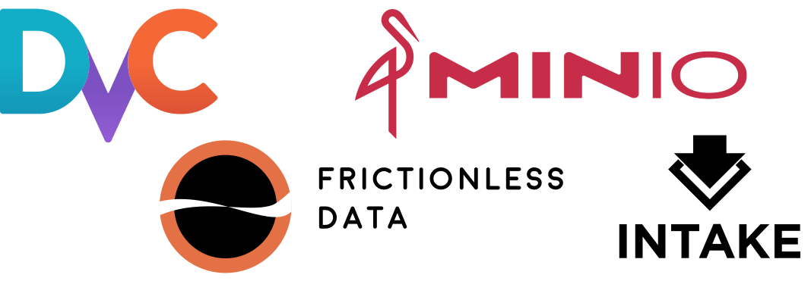
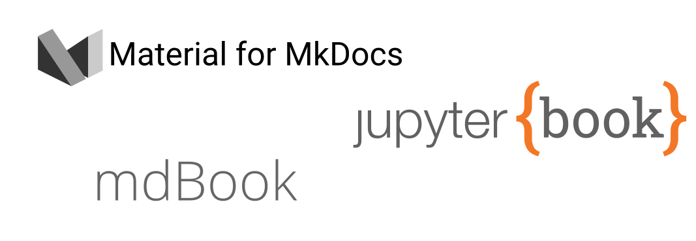

# Tools for Data Infrastructure

```{admonition} TL;DR
:class: tip, dropdown

1. Make sure your Source Control Management (SCM) is ready to use; we're using `git`
2. Sign up for a "git forge"; we're using GitHub.com
3. In relevant projects, use and build _data packages_ wherever possible; we're using `dvc`, since it's language-agnostic. 
4. (**optional**, but highly recommended) Document and share your project; we're using `jupyter-book`
5. (**optional**, but highly recommended) Schemas and testing for your data; we're using `pandera`
```


In the last section, we talked about the _engineering practice_, a body of "art" that consists of knowledge and accepted best-practice that supports experts in making context-sensitive decisions. 

```{margin}
Even with a known heading, getting from point A to point B is a lot easier with a nicely paved road. 
```
The other key component to problem solving in-context is a suite of tools in your "toolbox". 
Tools enable experts to efficiently accomplish their goals, and understanding the tools being used within your community will help you critique and contribute to other work, as well.
If the _practice_ is a technical community's mutual direction or heading, we might think of these tools as the _infrastructure_ of a technical community. 

Data Science tools, and text-analysis tools, by extentsion, care a great deal about how data gets used, so, let's call this idea _data infrastructure_. 

Data Infrastructure
:  digital infrastructure promoting data sharing and consumption

This, like the section before, is worth a course of it's own: spanning [development](https://aws.amazon.com/devops/what-is-devops/)- and [data](https://databand.ai/blog/dataops-org-structure/)-operations, software engineering principles, [information maintainers](https://themaintainers.org/information-maintenance-as-a-practice-of-care-an-invitation-to-reflect-and-share/), human factors, and plenty of [cautionary tales](https://timharford.com/2021/05/cautionary-tales-wrong-tools-cost-lives/). 

## What's the Big Idea? 

Rather than delving too deep here, it's important to get an idea of what the "big challenge" is, and some basic tools to get started for this course, specifically. 


### Theory vs. Practice

````{sidebar} "We have data science at home"

```{figure-md} alchemy


Alchemy, like magic, looks so _clean_!
```
````

Analysts, data scientists, etc., would like to:

1. Load their data 
2. Grab their trusty libraries of well-documented tools
3. $\rightarrow$ _pipeline_ $\rightarrow$
4. Report out _results_ that anyone can use and trust!


````{sidebar} The data science at home
```{figure-md} messy


The _pain_...
```
````

Like the "magic" practices from last section, this "alchemical" tool called a "pipeline" is so nice, assuming all the libraries , tools, and data work together like they _should_. 

In reality,**~80%** of an analyst's time is spent wrangling and preprocessing their data... everyone re-invents the wheel _for almost every analysis_!


### Containerize --- Data Packages!

I won't lie, this is a super sticky, outstanding problem. 
Many groups, around the world, are working on making data more reusable and reduce the load on analysts. 
See, for instance, the massive undertaking behind the [FAIR Data](https://www.go-fair.org/fair-principles/) Principles {cite}`wilkinson2016fair`: 

- Findable
- Accessible
- Interoperable
- Accessible

Or, for a more tooling-centric approach, the Open Knowledge Foundation has the Frictionless Data initiative to make open software and standards.

````{sidebar} Containerize all the things!
```{figure-md} containerize


Bundle the data with the libraries, documentation that you have already finished, to share with others in a uniform way!
```
````

In yet another parallel to the previous section, many solution types revolve around _isolation_, by bundling context-specific tools and data together in reproducible and transparent ways. 
These "bundles", or "containers", are often called _data packages_, that treat data the way the software engineering community has learned to treat code (i.e. Development Operations, or DevOps). 


```{admonition} Lesson from History
:class: tip
Shipping cargo pre-1956 looks a lot like data engineering does today: 

- costs were skewed 10-to-1 toward the loading/unloading phases
- Teams of dock-workers numbered in the 100's
- Why? Loading was specialized, as combinatoric case-by-case:
  - per-cargo-type (bananas? vehicles? oil?) needed special concerns
  - per-ship (length? width? fuel cost?) again, special concerns

Shipping containers changed this completely! {cite}`ebeling2009evolution`

- Containers provide a _uniform_ loading/unloading interface for ships (cranes$\rightarrow$trains$\rightarrow$trucks)
- The modular storage shape unified ship design needs (lots of identical boxes, stacked high)
- Interiors of each container were still a mess... but _solving_ was **asynchronous** & **distributed**.
```


## Getting Started
Here's a couple types of tools to get started down the path to this idea:

### Data-as-Code


Apply DevOps principles to data as DataOps, which treats **Data-as-Code**.
Through clever extension of Source Control Management, we can exploit existing DevOps infrastructure for

- Dependency management and provision
- Version Control and releases
- Reproducibility and programmatic access

So, we start with a DevOps baseline of SCM (`git`, `mercurial`, etc.) plus a social collaboration and project management system, like GitHub.com, GitLab.com, GitTea, etc. 

```{note}
We will be using `git` 

 - Not installed? `conda install git` in the base environment, assuming you followed along up to now. 
 - Read up on _why we care_ about `git` so much. {cite:t}`blischak2016quick` have you covered (and [use `git` themselves](https://github.com/jdblischak/git-for-science)).

and GitHub 

 - Acts like a "remote" for your code/text to get backed-up/synced to
 - Adds lots of nice social and project management features on top of commits/branches (e.g. Pull Requests, issues, forks, etc.)

```

From here, add a layer that extends SCM to work _nicely_ with large data files (it doesn't by default, for similar reasons that it doesn't like `.ipynb` files). 
Examples of this idea include `git-LFS`, [Pachyderm](https://www.pachyderm.com/), [Quilt](https://quiltdata.com/), and [DVC](https://dvc.org).

```{sidebar} Example Tools for DataOps

```

```{note}
We will be using `dvc`

- Think "makefile + git-lfs". It version controls data, and makes connections to code/other data _explicit_. Get started [here](https://dvc.org/).
- install as project requirement `conda install dvc-STORAGE` or package dependency `pip install dvc[STORAGE]`, where `STORAGE ∈ {ssh, html, s3, ...}`
- Use it to get and share data _cleanly_. `dvc import` will grab other data out there, `dvc pull` gets the latest data when available, and the `commit`, `pull`, `add` commands mimic `git` but for your data tracked with DVC. 
- The current GitHub equivalent for DVC is DagsHub.com, which we use [for this course](https://dagshub.com/tbsexton/text-data-course) to store and supply datasets on-demand. 
```


### Documentation- and Test-driven "Development"

There are some best-practices that will take your project to the "next level", and provide a lot of peace-of-mind if implemented _throughout_ the project (rather than at the end, in a rush)!

First, **Documentation** of data infrastructure is your container's "cargo manifest". 
This can be as simple as a `README.md`, or as complex as a pretty webpage, a dashboard, and beyond.
Some notes: 

- Separation of form and content will make refactoring much easier $\rightarrow$ use **Plain text** (`markdown`)
- Writing as a team, but using distributed and asynchronous collaboration $\rightarrow$ use **Version control** (`git`) 
- Ok, but make sure I can deploy PDF's, websites, etc? $\rightarrow$ toeghter, we've got a **Static site generator**


```{sidebar} Example Tools for Documentation

```

```{note}
- Static site generators, like `sphinx` or `mkdocs` for python. Build it early and often!
- This site is built on [`jupyter-book`](https://jupyterbook.org) to turn markdown and jupyter notebooks into beautiful documentation.
- [mkdocs-material](https://squidfunk.github.io/mkdocs-material/getting-started/) is another popular option for modern mkdocs. 
```

Finally, the phrases "unit test" and "schema validation" get a bad rap in our community. 
But it helps if you think of writing "tests" more like installing sensors in your "shipping container". 
They provide a suite of positive assertions about your (the authors') expectations and assumptions about the code and data. 
They are your eyes and ears into what happens when conditions around and inside your "container" changes.

```{note}
Make your (and everyone else's) life easier by adding semantic information about your data. Options include

- [jsonschema](https://json-schema.org/)? Try [pydantic](https://pydantic-docs.helpmanual.io/)
- [GraphQL](https://graphql.org/)? [strawberry](https://strawberry.rocks/) is new and shiny, built to work like/with pydantic. 
- Straight DataFrames? Try [pandera](https://pandera.readthedocs.io/en/stable/), also working on pydantic interop. 
- More general tabular solution: [frictionless](https://framework.frictionlessdata.io/) framework is quite powerful. 
- [Intake](https://github.com/intake/intake) can help both with making data packages and describing the datasets themselves. 

Unit tests will help you find mistakes and collaborate with peace-of-mind. 
For python, specifically: 

- [`pytest`](https://docs.pytest.org/en/6.2.x/) in general, as the current de-facto standard.
- [`datatest`](https://datatest.readthedocs.io/en/stable/) and/or `pandera` for your data. 
- [`hypothesis`](https://hypothesis.readthedocs.io/en/latest/) can automatically generate tests through parameterization. 
```

## Conclusion

_Phew_, that was a lot of ground. 
It probably feels overwhelming, but what I actually want to do is help you feel like _you are not alone_. 
So many classes focus on theory and application as a _separate thing_ from the tools being used within a community. 
There is an infrastructure out there, and though it may be ever-changing and vast, it is crucial to invest time into teaching yourself some new tricks. 

Plus, nearly all of the tools mentioned here, anecdotally, will end up _saving time_, in the not-so-long run. 
After all, they are like the paved roads to your direction. 
You might need to learn how to drive, but you'll get many more places, much faster, on the highway than on the gravel trail.


```{bibliography}
:style: unsrtalpha
:filter: docname in docnames
```
