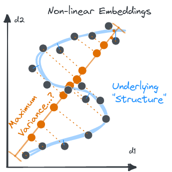

---
jupytext:
  text_representation:
    extension: .md
    format_name: myst
    format_version: 0.13
    jupytext_version: 1.11.5
kernelspec:
  display_name: Python [conda env:text-data]
  language: python
  name: conda-env-text-data-py
---

# Prelude: On Reduction and High Dimensional Pancakes

```{code-cell} ipython3
import matplotlib.pyplot as plt
import numpy as np
plt.xkcd()
```

## High Dimensional Space is ... Spikey?

+++


```{code-cell} ipython3
# dims = np.arange(10)+2
f,ax=plt.subplots(ncols=2,figsize=(10,4))
dims=np.arange(2,11)
sm=(np.sqrt(dims)-1)
   
ax[0].axhline(2, ls=':', c='grey')
ax[0].axhline(4, ls='--', c='grey')
ax[0].plot(dims, 2*sm, 
           label='Dia. of small sphere', c='#1e90ff')
ax[0].legend()
ax[0].set_xlabel('dimensions')
from scipy.special import gamma
vols=np.pi**(dims/2)/gamma(1+dims/2)
ax[1].plot(dims, vols, 
           label='Vol. of spheres', c='grey', ls=':')
ax[1].plot(dims, (sm**dims)*vols, 
           label='Vol. of small sphere', c='#1e90ff')

# ax[1].plot(dims, 4**dims, ls=':')
# ax[1].set_xlim(2,10)
ax[1].set_ylim(0,10)
ax[1].legend()
```

(the volume of the hypercube is _way_ up there)

+++

A big take-away: there's a lot of "volume" in high dimensions. Unimaginable amounts of "space."

Often, though, the processes and definitions of things we want to "observe" (like the unit-spheres, or spheres touching those...) do not occupy that space in _intuitive_ ways as dimensionality increases. The relative sizes and distances between things get very stretched out... almost diluted. 

> It's easy to lose stuff in all that space.

+++

## Dimensionality Reduction

+++

Do we really need all those dimensions? 

- Do you need 3 dimensions to represent a racetrack? (track is technically banked, but...)
- Do you need 2 dimensions to represent a 100m sprint? (runners technically standing apart, but...)

Text analysis tends to involve huge matrices, i.e. a _lot_ of dimensions. But the "interesting stuff" is almost certainly happening in a lot fewer dimensions, _if you slice it right_.

+++

### What _is_ Singular Value Decomposition?

+++

Decompose a matrix $M$ into two orthonormal ones and a diagonal one: 

$$M = U\Sigma V^*$$

This can be understood geometrically as saying 
> every linear transformation can be broken down into: rotation $\rightarrow$ scaling $\rightarrow$ rotation

+++


(credit: Georg-Johann, August 2010)

+++

### Matrix-as-Data? Principal Components Analysis (PCA)

+++


+++

### Low-Rank Approximation as "Compression"

What if we did this pancake procedure..._in "reverse"?_
- We have the "optimal hyperellipse"
- throw away the dimensions that are _least_ variant

In high dimensions, as we've seen, these should be radically "thinner" than our "most" variant directions. 
> Practically pancakes already!

+++


```{code-cell} ipython3
:cell_style: split

from sklearn.decomposition import TruncatedSVD
from sklearn.datasets import load_sample_image
gs = load_sample_image('flower.jpg')[...,:3]@np.array([0.2125,0.7154,0.0721])
plt.imshow(gs, cmap='Greys_r')
plt.axis('off')

gs.shape
```

```{code-cell} ipython3
:cell_style: split

def compress(n, ax=None):
    svd = TruncatedSVD(n_components=n)
    svd.fit(gs)
    if ax is not None: 
        ax.imshow(svd.transform(gs)@svd.components_, 
                  cmap='Greys_r')
        ax.axis('off')
    return svd
```

**1-D Approximation of the image**
(each data point is a "row" of pixels)

```{code-cell} ipython3
:hide_input: false

from mpl_toolkits.axes_grid1 import make_axes_locatable
f,ax=plt.subplots(figsize=(10,10))
svd = compress(1, ax=ax)

# create new axes on the right and on the top of the current axes
divider = make_axes_locatable(ax)
# below height and pad are in inches
ax_loads = divider.append_axes("top", 1.1, pad=0.1)
ax_data = divider.append_axes("left", 1.1, pad=0.1)

# make some labels invisible
ax_loads.xaxis.set_tick_params(labelbottom=False)
ax_data.yaxis.set_tick_params(labelright=False)

loads = svd.components_
ax_loads.plot(loads[0], label='feature\nloads')
ax_loads.set_ylabel('feature\nloads')
ax_data.plot(svd.transform(gs), range(len(gs)), ls=':', label='projected\ndata')
ax_data.set_xlabel('projected data');
```

**2-D scatterplot projection of the "rows"**
(each point approximates an entire row of pixels in 2D)

```{code-cell} ipython3
f,ax =plt.subplots(ncols=2, figsize=(14,5))
pancake = compress(2, ax=ax[0]).transform(gs)
pc12 = ax[1].scatter(pancake[:,1], pancake[:,0], 
              c=np.arange(len(pancake)), cmap='cubehelix')
ax[1].set(ylabel='pc1', xlabel='pc2', title='2D projection of pixel rows')
plt.tight_layout()
f.colorbar(pc12, label='row #')
```

This is wild. 
Our intuition is really hard to build here, but the start and end rows _are_ roughly similar. The middle "grows" then "shrinks", reflected in the push and pull of green and pink, while the noise of petals is captured by the "fuzziness" of the points there. 

Still, why are similar rows so far apart? Stuff seems weirdly spread out, and weirdly shaped. 

+++

### How many dimensions?
> mow much should we "pancake"? 

```{code-cell} ipython3
svd=compress(30);
plt.bar(x=range(30),height=svd.explained_variance_ratio_)
plt.title('Scree plot')
plt.ylabel('Explained Variance Ratio')
plt.xlabel('n. dimensions')
plt.axvline(3.5, ls='--', c='xkcd:rust', label='...ish?')
plt.legend();
```

**But how does it _look_?**

```{code-cell} ipython3
def img_approx(mat, which):
    
    num=len(which)
    f,ax=plt.subplots(ncols=3, nrows=num//3,figsize=(16,5*(num//3)))
    for n,idx in enumerate(which):
        compress(idx, ax=ax.flatten()[n])
        ax.flatten()[n].text(0.1, 0.8, f'{idx}', transform=ax[n].transAxes)

img_approx(gs, [5, 15, 30])

# 
```

Even though the variance has been captured, it's hard to see "what it is" without detail. Our brains are _not_ treating each row of pixels as a distince observation, anymore than we read a document of english text in isolation!

+++

### Individual Singular Vectors as "Slices"

+++


```{code-cell} ipython3
from scipy import linalg

def img_topics(mat, which):
    U, s, Vh = linalg.svd(mat, full_matrices=False)
    def each_topic(n, ax):
        topic = U[:,n, np.newaxis]@(s[n]*Vh[np.newaxis,n,:])
        ax.imshow(topic, cmap='Greys_r')
        ax.axis('off')
    
    f,ax=plt.subplots(ncols=len(which), figsize=(16,4))
    for n,idx in enumerate(which):
        ax[n].text(0.1, 0.8, f'{idx}', transform=ax[n].transAxes)
        each_topic(idx, ax=ax[n])

img_topics(gs, range(3))
img_topics(gs, range(3,6))
img_topics(gs, range(6,9))
```

**NOTE**

It doesn't make sense to say each of the above are "clusters", does it? REMEBER THIS. 

>Components of a matrix decomposition are **not the same** as clusters data.
>
> Every "component" has a value for the space of every data point (not some cluster of them)!

While each is a group of pixels that _do something together_, and that "something" is _orthogonal_ to all the other somethings (i.e. they do unique "stuff" in Euclidean space)


+++

## Non-Linear "Pancake" Flavors

+++ {"cell_style": "split"}

### Manifold Learning 

Ok, let's break the assumption that a linear projection gives us our reduction. 

Most of the time, we lose the "global" interpretation of our "new" axes, but we want to gain _local_ linearity. This way, we gain local relationships _back_ in our lower dimensional relation. This object that maintains "local" distance relationships is a lower-diensional _manifold_. 
Sort've like squishing data into a... "floppy" pancake?

Examples: [MDS](https://scikit-learn.org/stable/modules/manifold.html#multi-dimensional-scaling-mds), [tSNE](https://scikit-learn.org/stable/modules/manifold.html#t-distributed-stochastic-neighbor-embedding-t-sne), [UMAP](https://umap-learn.readthedocs.io/en/latest/) 
- multi-dimensional scaling
- t-distributed Stochastic Neighbor Embedding
- uniform manifold approximation and projection[^1]

[^1]: Often the best-performing, see [interactive explanation](https://pair-code.github.io/understanding-umap/)

+++ {"cell_style": "split"}



```{code-cell} ipython3
from sklearn.decomposition import FastICA
from sklearn.manifold import TSNE

manifold = TSNE()
pancake = manifold.fit_transform(gs)
f,(img,ax)=plt.subplots(1,2, figsize=(12,5))
pc12 = ax.scatter(pancake[:,1], pancake[:,0], 
              c=np.arange(len(pancake)), cmap='cubehelix')
# plt.scatter(svd.transform(gs)[:,0], svd.transform(gs)[:,1])
ax.set(ylabel='pc1', xlabel='pc2', title='2D tSNE projection of pixel rows')
f.colorbar(pc12, label='row #')
img.imshow(gs, cmap='Greys_r')
img.axis('off')
plt.tight_layout()
```

As hoped, each row is approximately touching it's neighbor, except where there's an actual _jump_ in colors. 

Notice global stuff is much less pronounced, instead giving us a hint at "what's going on", _locally_!
See how the rows start and end at _different_ positions, despite being very similar, objectively? 
This is because they are heading in _different directions_ (growing white, vs shrinking white). 

+++ {"cell_style": "split"}

### Independence & Blind Source Separation 

What if, instead of trying to find additive components that maximize **variance** (accounted for in each subsequent orthogonal dimension), we instead maximize the **mutual independence** of some number of components?

Classic example: 
- On a stage, you have some number (K) of microphones, and some number (N) of instruments
- Can you use the unique recordings of _mixed_ instrument audio to "unmix" the recordings? Yes!

In our case, each "microphone" is a data point, and each "instrument" is a component vector. 

+++ {"cell_style": "split"}


(source: scikit-learn.org)

+++

## Takeaway
Dimensionality reduction is very powerful, and it _feels_ like it. BUT...

- there are serious implications when you choose a specific _type_ of reduction... really depends on what you want to accomplish
- Building an intuition takes time, but is crucial to proper usage _and_ making sure you ask yourself (and others) good questions, constantly!

+++

> But where's the _text_?? 

As mentioned, we are now focusing primarily on vector-based models for context-driven models of language. 
This means we need to be comfy with what big matrices actually _are_, the _curse of dimensionality_, and how different assumed goals deal with that. 

And trust me, this will come very much in handy for the next section on _clustering & topic modeling_

```{code-cell} ipython3

```
